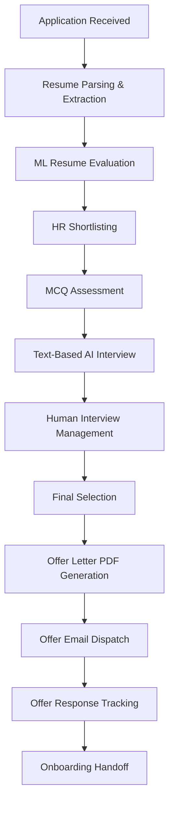

# HR Recruitment Management System

An end-to-end, enterprise-grade HR Recruitment Management System designed to streamline candidate intake, resume classification, automated assessments, structured human interviews, offer generation with PDF creation, and onboarding handoffs.

---

## 🚀 Architecture & Tech Stack

- **Frontend**: React 19, Vite, Tailwind CSS, Recharts, React Router 7
- **Backend**: Python 3.10+, FastAPI, PyMuPDF, python-docx, Jinja2, Playwright, OpenPyXL
- **Database & Auth**: Supabase PostgreSQL, Supabase Storage (Private Buckets), Supabase Auth with TOTP MFA
- **Machine Learning**: Custom Scikit-Learn Pipeline (`TF-IDF` + `RandomForestClassifier`), Trained on domain-specific internship recruitment datasets

---

## 📋 Complete Recruitment Pipeline



1. **Intake & Parsing**: Multi-format resume parsing (PDF/DOCX) with magic-byte validation and entity extraction.
2. **ML Evaluation**: Custom-trained ML classifier predicting fit with matching and missing skills breakdown.
3. **HR Shortlisting**: Explicit HR-controlled decisioning with audit logging.
4. **MCQ Assessment**: Dynamic question bank generation with single-use, 72-hour SHA-256 tokens.
5. **Text Interview**: Curated domain questions with manual HR review (runtime LLMs intentionally deferred).
6. **Human Interviews**: Multi-round interview scheduling, interviewer-scoped access, attendance, and scoring.
7. **Final Selection**: Comprehensive recruitment record review before offer authorization.
8. **Offer Generation**: Versioned HTML offer templates rendered to secure PDFs via Playwright.
9. **Offer Email Delivery**: In-memory PDF attachment handoff to SMTP provider with fail-safe retries.
10. **Response Tracking**: Tracks Candidate decisions (Accepted, Declined, Negotiating, Expired).
11. **Onboarding Handoff**: Tracks document verification checklists and IT provisioning requests without building a full HRIS.
12. **Analytics & Reporting**: Real-time pipeline funnels, department conversion rates, debounced global search, and Excel/CSV exports.

---

## 🗄️ Database Migrations

Apply migrations in sequential order using your Supabase SQL Editor:
1. `server/supabase/migrations/001_initial_schema.sql`
2. `server/supabase/migrations/002_assessment_override.sql`
3. `server/supabase/migrations/003_ai_interview_hr_review.sql`
4. `server/supabase/migrations/004_interview_management.sql`
5. `server/supabase/migrations/005_offer_pdfs_bucket.sql`
6. `server/supabase/migrations/006_onboarding_handoff.sql`
7. `server/supabase/migrations/007_indexes_hardening.sql`

---

## ⚙️ Environment Setup

### Backend Setup (`server/.env`)
```bash
cp server/.env.example server/.env
```
Populate `server/.env` with your Supabase keys and SMTP settings.

### Frontend Setup (`client/.env`)
```bash
cp client/.env.example client/.env
```
Set `VITE_SUPABASE_URL` and `VITE_SUPABASE_PUBLISHABLE_KEY`.

---

## 🏃 Running the Application

### 1. Start FastAPI Backend
```powershell
cd server
venv\Scripts\activate
uvicorn app.main:app --reload
```
API running on `http://127.0.0.1:8000`.

### 2. Start React Frontend
```powershell
cd client
npm install
npm run dev
```
Client running on `http://localhost:5173`.

---

## 🧪 Testing & Validation

### Run Pytest Backend Test Suite
```powershell
cd server
pytest -v
```

### Run Frontend Production Build
```powershell
cd client
npm run build
```

---

## 🔒 Security Highlights

- **RBAC**: Strict role enforcement (`require_hr_admin`) across all administrative endpoints.
- **Candidate Tokens**: Stage-scoped, SHA-256 hashed, single-use, application-bound, and TTL-expiring.
- **File Uploads**: 5 MB limit, extension whitelist, and magic-byte header validation.
- **Private Storage**: Resumes and offer PDFs are stored privately and streamed securely in memory.
- **Rate Limiting**: In-memory sliding window rate limiting on authentication and token endpoints.
- **Audit Trails**: Immutable, append-only audit logging.

---

## 📌 Scope Boundaries
- **Runtime LLM Integration**: Deferred to future roadmap.
- **Voice/Video Calling**: Excluded from current scope.
- **Full HRIS (Payroll/Leave/Attendance)**: Excluded by design; system concludes at onboarding handoff.
